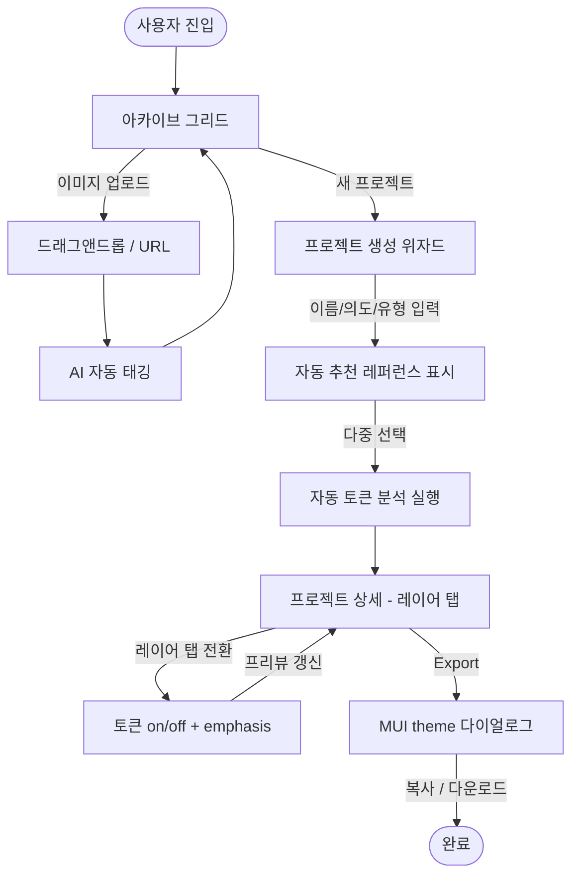

# MUSE — UX Flow

## 유저 시나리오

### 시나리오 1: 레퍼런스 수시 아카이빙

- **사용자**: 디자이너 / 바이브 코딩 유저
- **목표**: 평소 영감을 받은 이미지를 프로젝트와 무관하게 모아둔다
- **플로우**:
  1. 아카이브 화면 진입 (인피니트 그리드 뷰)
  2. 이미지 드래그앤드롭 또는 URL 붙여넣기
  3. 자동 태깅 실행 (컬러톤 / 스타일 / 카테고리)
  4. 그리드에 즉시 추가 (태그 배지 표시)
- **성공 조건**: 업로드 후 2초 이내 썸네일 노출, 태그는 비동기로 채워짐
- **예외 상황**: 링크 로드 실패 → 재시도 버튼, AI 태깅 실패 → 수동 태그 가능

### 시나리오 2: 프로젝트 생성 & 레퍼런스 큐레이션

- **사용자**: 디자이너
- **목표**: 특정 프로젝트 방향에 맞는 레퍼런스를 선택해 묶는다
- **플로우**:
  1. "새 프로젝트" 진입 → 이름, 한 문장 의도, 유형(랜딩/대시보드/모바일/브랜드) 입력
  2. (선택) 의도 문장 기반 자동 추천 레퍼런스 확인
  3. 아카이브에서 이미지 다중 선택 (태그 필터 사용 가능)
  4. 프로젝트 생성 완료 → 자동 토큰 분석 자동 시작
- **성공 조건**: 프로젝트 생성 화면에서 분석 완료 화면까지 3분 이내
- **예외 상황**: 0장 선택 시 생성 버튼 비활성, 분석 중 이탈 시 백그라운드 진행

### 시나리오 3: 토큰 확인 및 조정

- **사용자**: 디자이너 / 바이브 코딩 유저
- **목표**: AI가 추출한 토큰을 의도에 맞게 다듬는다
- **플로우**:
  1. 프로젝트 상세 진입 → 레이어 탭(컬러/타이포/레이아웃/그라디언트/키비주얼)
  2. 레이어별 토큰 목록 확인
  3. 불필요 토큰 제거(토글 off) 또는 중요 토큰 강조(emphasis 상승)
  4. 실시간으로 프리뷰 영역 업데이트
- **성공 조건**: 토큰 on/off 시 200ms 이내 프리뷰 반영
- **예외 상황**: 전체 제거 시 최소 1개 유지 경고

### 시나리오 4: MUI theme export

- **사용자**: 바이브 코딩 유저
- **목표**: 정리된 토큰을 Cursor/Claude Code에 투입한다
- **플로우**:
  1. 프로젝트 상세에서 "Export" 클릭
  2. MUI theme 코드 다이얼로그 표시
  3. 복사(Copy) 또는 파일 다운로드
- **성공 조건**: 클립보드에 유효한 MUI `createTheme` 객체 복사
- **예외 상황**: 필수 토큰(palette.primary 등) 미충족 시 경고 표시

---

## UX 플로우



---

## 정보 구조 (IA)

```
MUSE
├── 아카이브 (/)
│   ├── 인피니트 그리드 (이미지 + 태그)
│   ├── 검색 / 태그 필터
│   └── 업로드 영역 (드래그앤드롭 + URL 입력)
├── 프로젝트 목록 (/projects)
│   └── 프로젝트 카드 (2x2 썸네일 + 이름 + 유형)
├── 프로젝트 생성 (/projects/new)
│   ├── Step 1. 이름 + 의도 + 유형
│   ├── Step 2. 레퍼런스 선택 (추천 + 아카이브)
│   └── Step 3. 분석 진행 화면
├── 프로젝트 상세 (/projects/:id)
│   ├── 레이어 탭 (컬러 / 타이포 / 레이아웃 / 그라디언트 / 키비주얼)
│   ├── 토큰 목록 + 편집 패널
│   ├── 실시간 프리뷰 영역
│   └── Export 액션
└── 설정 (/settings)
    └── AI 모델 / 스토리지 / 테마
```

---

## 데이터 모델

| 엔티티 | 주요 필드 | 관계 |
|--------|----------|------|
| `Reference` | `id`, `source` (file/url), `thumbnailUrl`, `tags[]`, `dominantColors[]`, `createdAt` | 1:N Project (via projectReferences) |
| `Project` | `id`, `name`, `intent`, `type` (landing/dashboard/mobile/brand), `referenceIds[]`, `createdAt` | N:M Reference |
| `AnalysisResult` | `id`, `projectId`, `layers` ({color, typography, layout, gradient, keyVisual}), `status`, `updatedAt` | 1:1 Project |
| `Token` | `id`, `layer`, `key`, `value`, `isEnabled`, `emphasis` (0–2), `sourceReferenceIds[]` | N:1 AnalysisResult |
| `UserSettings` | `aiModel`, `storageMode`, `themeMode` | singleton |

---

## 컴포넌트 리스트

역할별로 그룹핑. 각 그룹은 MUSE의 주요 화면/기능 단위에 대응한다.

### A. 앱 골격 — 글로벌 레이아웃 · 네비게이션

전체 화면에 공통으로 깔리는 셸과 컨테이너.

| 컴포넌트 | 용도 | 구분 | 기존 경로 / 비고 |
|----------|------|------|-----------------|
| `AppShell` | 전역 레이아웃 (GNB + 메인 영역) | 재활용 | `components/layout/AppShell.jsx` |
| `GNB` | 글로벌 네비게이션 바 | 재활용 | `components/navigation/GNB.jsx` |
| `PageContainer` | 반응형 페이지 컨테이너 | 재활용 | `components/layout/PageContainer.jsx` |
| `SectionContainer` | 섹션 단위 컨테이너 | 재활용 | `components/container/SectionContainer.jsx` |

### B. 아카이브 — 레퍼런스 수집 · 탐색

아카이브 화면의 수집/탐색 흐름을 담당.

| 컴포넌트 | 용도 | 구분 | 기존 경로 / 비고 |
|----------|------|------|-----------------|
| `FileDropzone` | 드래그앤드롭 / URL 업로드 | 재활용 | `components/input/FileDropzone.jsx` |
| `Masonry` (MUI) | 인피니트 그리드 베이스 | 수정 | 인피니트 스크롤 훅 연결 |
| `ImageCard` | 레퍼런스 썸네일 + 태그 배지 + 선택 체크박스 | 수정 | `components/card/ImageCard.jsx` 확장 |
| `SearchBar` | 아카이브 검색 | 재활용 | `components/input/SearchBar.jsx` |
| `FilterBar` | 태그/컬러톤 필터 | 재활용 | `components/templates/FilterBar.jsx` |
| `TagInput` | 개별 레퍼런스 태그 편집 | 재활용 | `components/input/TagInput.jsx` |

### C. 프로젝트 — 목록 · 생성

프로젝트 관리 및 3-step 생성 위자드.

| 컴포넌트 | 용도 | 구분 | 기존 경로 / 비고 |
|----------|------|------|-----------------|
| `MoodboardCard` | 프로젝트 목록 카드 (2x2 썸네일) | 재활용 | `components/card/MoodboardCard.jsx` |
| `CardContainer` | 카드 기본 컨테이너 | 재활용 | `components/card/CardContainer.jsx` |
| `TextField` / `Select` / `Button` | 이름·의도·유형 입력 폼 | 재활용 | MUI |
| `ProjectCreateWizard` | 3스텝 생성 위자드 (이름/의도/유형 → 레퍼런스 선택 → 분석) | 신규 | 카테고리: `templates` |
| `ReferencePicker` | 추천 + 아카이브 다중 선택 패널 | 신규 | 카테고리: `templates` |

### D. 분석 피드백 — 진행 상태 · 경고

분석 실행 중 및 경고 상황 피드백.

| 컴포넌트 | 용도 | 구분 | 기존 경로 / 비고 |
|----------|------|------|-----------------|
| `Dialog` (MUI) | 경고/확인 모달 | 재활용 | MUI |
| `AnalysisProgress` | 분석 진행 상태 표시 (레이어별 단계 인디케이터) | 신규 | 카테고리: `overlay-feedback` |

### E. 토큰 편집 — 프로젝트 상세 셸

레이어 전환과 편집/프리뷰 분할 레이아웃.

| 컴포넌트 | 용도 | 구분 | 기존 경로 / 비고 |
|----------|------|------|-----------------|
| `CategoryTab` | 레이어 탭 (컬러/타이포/레이아웃/그라디언트/키비주얼) | 재활용 | `components/in-page-navigation/CategoryTab.jsx` |
| `SplitScreen` | 토큰 편집 패널 + 프리뷰 좌우 분할 | 재활용 | `components/layout/SplitScreen.jsx` |
| `Switch` | 토큰 on/off 토글 | 재활용 | MUI |
| `TokenListItem` | 레이어 공통 토큰 행 (on/off + emphasis 슬라이더) | 신규 | 카테고리: `data-display` |

### F. 레이어별 프리뷰 — 토큰 시각화

편집 결과를 즉시 확인하는 레이어별 시각화 컴포넌트.

| 컴포넌트 | 용도 | 구분 | 기존 경로 / 비고 |
|----------|------|------|-----------------|
| `ColorSwatchList` | 컬러 토큰 스와치 + HEX + 토글 | 신규 | 카테고리: `data-display` |
| `TypographyPreview` | 타이포 샘플 텍스트 + 속성 미리보기 | 신규 | 카테고리: `data-display` |
| `LayoutTokenPreview` | 그리드/스페이싱 다이어그램 | 신규 | 카테고리: `data-display` |
| `GradientPreview` | 그라디언트 토큰 스와치 | 신규 | 카테고리: `data-display` |
| `KeyVisualBoard` | 키비주얼 이미지 보드 | 신규 | 카테고리: `data-display` |

### G. Export — 산출물 내보내기

MUI theme 코드 최종 산출 흐름.

| 컴포넌트 | 용도 | 구분 | 기존 경로 / 비고 |
|----------|------|------|-----------------|
| `ThemeExportDialog` | MUI theme 코드 다이얼로그 (복사/다운로드) | 신규 | 카테고리: `overlay-feedback` (Dialog 확장) |
| `Button` | Export 트리거 | 재활용 | MUI |

---

### 그룹별 합계

| 그룹 | 재활용 | 수정 | 신규 |
|------|-------|------|------|
| A. 앱 골격 | 4 | 0 | 0 |
| B. 아카이브 | 4 | 2 | 0 |
| C. 프로젝트 | 4 | 0 | 2 |
| D. 분석 피드백 | 1 | 0 | 1 |
| E. 토큰 편집 셸 | 3 | 0 | 1 |
| F. 레이어 프리뷰 | 0 | 0 | 5 |
| G. Export | 1 | 0 | 1 |
| **합계** | **17** | **2** | **10** |

---

## 핵심 설계 포인트

- **아카이빙과 프로젝트 생성의 분리**: 아카이빙은 수시로, 프로젝트는 의도 기반 큐레이션 — 두 플로우의 진입점을 명확히 구분
- **분석은 비동기·백그라운드**: 생성 이탈 후 돌아와도 결과 확인 가능
- **토큰 편집 = on/off + emphasis 2축**: 삭제가 아닌 비활성화 기반으로 언제든 복원 가능
- **Export는 최종 산출물**: 편집 결과가 즉시 MUI `createTheme` 객체로 직렬화 가능해야 함
