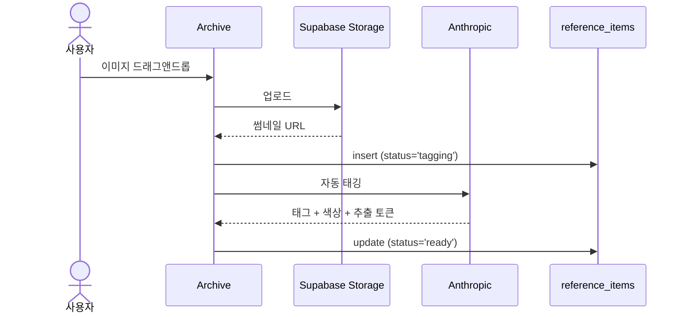
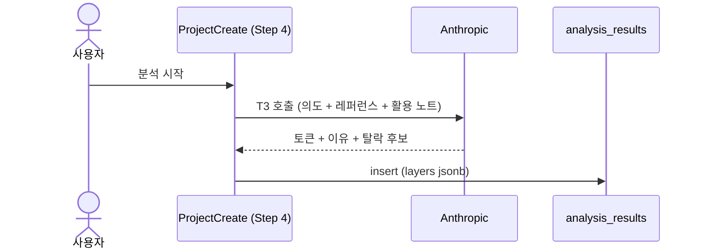
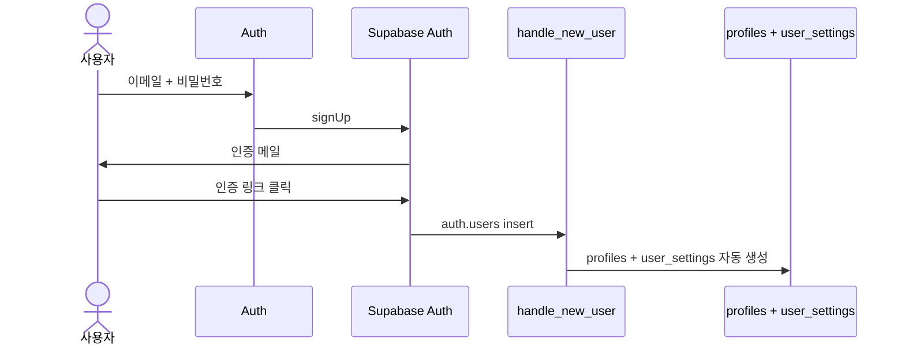

# MUSE. Data Bridge

> ux-flow 의 데이터 모델이 Supabase 와 어떻게 연결되는지 설명.
> 컬럼 / 제약 / SQL 은 [`appendix-db-schema.md`](./appendix-db-schema.md).

**입력**: [02-ux-flow.md § 데이터 모델 활용](./02-ux-flow.md)

## 1. 데이터 모델은 어떤 DB 테이블이 되나?

ux-flow 의 사전을 그대로 인용. 데이터명이 어느 Supabase 테이블에 저장되는지 1:1.

| 데이터명 | 예상 테이블명 | 설명 (1줄) |
|---|---|---|
| `Reference` | `reference_items` | 사용자가 모은 영감 이미지 |
| `Project` | `projects` | 의도+모드+레퍼런스 큐레이션 묶음 |
| `ProjectReference` | `project_references` | 한 프로젝트가 어떤 레퍼런스를 어떤 레이어로 활용 (M:N) |
| `AnalysisResult` | `analysis_results` | AI 가 만든 디자인 토큰 묶음 |
| `UserSettings` | `user_settings` | 사용자별 AI 모델 / 스토리지 / 테마 |
| `User` | `auth.users` (Supabase 내장) | 가입 사용자 |

## 2. UX-flow 의 어느 시점에 DB 가 업데이트되나?

ux-flow 의 UX-flow 단계별 서사를 따라가며, 각 단계에서 어떤 테이블이 변하는지.

### 시나리오 1. 레퍼런스 아카이빙

- **이미지 업로드** (Archive) → `reference_items` insert (status='tagging'). 이미지 본체는 Supabase Storage 의 `references` 버킷에 저장.
- **자동 태깅 완료** → 같은 row update (tags / dominant_colors / extracted 채움, status='ready'). Anthropic vision 응답 반영.

### 시나리오 2. 프로젝트 생성 5-step

- **Step 0 모드 선택** (ProjectCreate) → `projects` insert (mode 만 채워진 row)
- **Step 1 제목 + 의도** → 같은 `projects` row update (name, intent)
- **Step 2 layer chip** → 선택한 레퍼런스마다 `project_references` insert/update (use_layers 토글). `reference_items` 는 R 만.
- **Step 3 활용 노트** → `projects` row update (user_notes)
- **Step 4 AI 분석** → `analysis_results` insert (Anthropic 응답을 layers jsonb 로 통째 저장)

### 시나리오 3. 토큰 확인 + 결정 추적

- **ProjectDetail 진입** (ProjectDetail) → `analysis_results` + `projects` + `reference_items` 모두 R 만.
- **on/off + emphasis 편집** → `analysis_results` row update (layers jsonb 의 isEnabled / emphasis 필드)

### 시나리오 4. Export

- **DB 업데이트 없음**. `projects` + `analysis_results` + `reference_items` 모두 R 만 해서 ZIP 묶음 생성.

### 가입 흐름 (시나리오 외부)

- **Auth 가입** (Auth) → `auth.users` insert (Supabase Auth). 동시에 `handle_new_user` 트리거가 `profiles` + `user_settings` 의 default row 자동 생성.

## 3. 각 페이지는 어떤 DB 와 연결되나?

페이지 중심 표. R = 읽기, W = 쓰기 (insert/update).

| 페이지 | 다루는 테이블 | 동작 |
|---|---|---|
| Auth | `auth.users` + `profiles` + `user_settings` | W (가입 시 자동 생성) |
| Archive | `reference_items` | W (업로드 + 자동 태깅) + R (그리드) |
| ProjectList | `projects` | R |
| ProjectCreate | `projects` + `project_references` + `analysis_results` + `reference_items` | W (Step 0~4) + R (레퍼런스 선택) |
| ProjectDetail | `analysis_results` + `projects` + `reference_items` | R + 편집 시 `analysis_results` W |
| Settings | `user_settings` | R + W |

## 4. 외부 의존 데이터의 라이프사이클

외부 API / Storage / Auth 가 끼는 비동기 흐름만. 단순 CRUD 데이터 (`Project` / `ProjectReference` / `UserSettings`) 는 시퀀스 생략.

### Reference (Storage 업로드 + Anthropic 자동 태깅)

### AnalysisResult (Anthropic 분석)

### User (Supabase Auth + 트리거)

## 5. 정합성 체크

- [x] § 1 의 데이터명·테이블명이 ux-flow 사전과 글자 단위 일치
- [x] § 2 의 단계가 ux-flow UX-flow 단계별 서사의 단계와 일치
- [x] § 3 의 페이지명 (Auth / Archive / ProjectList / ProjectCreate / ProjectDetail / Settings) 이 ux-flow 페이지 리스트의 행과 글자 단위 일치
- [x] § 4 시퀀스의 외부 의존 (Storage / Anthropic / Supabase Auth) 이 ux-flow UX-flow 단계별 서사의 트리거와 일치
- [x] 본문에 SQL/컬럼/제약/훅 코드 0건 (있으면 [appendix-db-schema.md](./appendix-db-schema.md) 로 분리)
