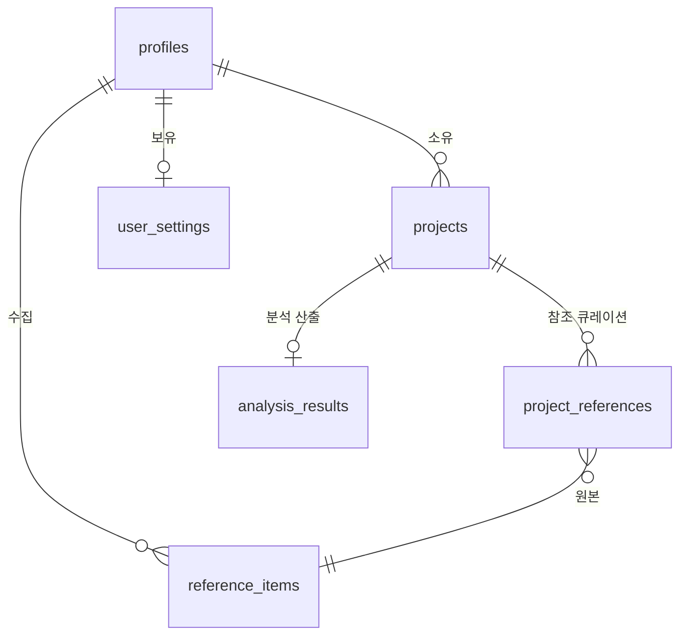

# appendix. DB Schema (MUSE)

> [`04-data-bridge.md`](./04-data-bridge.md) 의 DB 컬럼을 PostgreSQL DDL 로 변환한 부록. 디자이너 미열람 전제.
> 마이그레이션 파일: `supabase/migrations/*.sql` (실제 적용된 SQL).

## 개요

- 프로젝트: MUSE
- 총 테이블 수: 6 (`profiles` / `reference_items` / `projects` / `project_references` / `analysis_results` / `user_settings`)
- 공통 컬럼: `id uuid default gen_random_uuid()`, `created_at timestamptz`, `updated_at timestamptz`
- 공통 트리거: `set_updated_at` (BEFORE UPDATE)
- 모든 테이블 `ENABLE ROW LEVEL SECURITY`. 정책은 [appendix-rls-policies.md](./appendix-rls-policies.md).
- 삭제 정책: hard delete + ON DELETE CASCADE (소유자 삭제 시 연쇄)

## ERD

## 테이블 상세

### 1. `profiles` (User 의 프로필 부분)

| 컬럼 | 타입 | 제약 | 설명 |
|------|------|------|------|
| id | uuid | PK, FK → auth.users.id ON DELETE CASCADE | 사용자 ID |
| nickname | text | NOT NULL, UNIQUE | 닉네임 |
| avatar_url | text | NULLABLE | 아바타 URL |
| created_at | timestamptz | default now() | 생성 시각 |
| updated_at | timestamptz | default now(), trigger | 수정 시각 |

**인덱스**: `nickname (UNIQUE)`
**트리거**: `set_updated_at`, `handle_new_user` (auth.users insert → profiles insert. [appendix-auth-design.md](./appendix-auth-design.md))

### 2. `reference_items` (`Reference` 매핑. 테이블명은 PG 예약어 회피)

| 컬럼 | 타입 | 제약 | 설명 |
|------|------|------|------|
| id | uuid | PK | 레퍼런스 ID |
| user_id | uuid | NOT NULL, FK → profiles.id ON DELETE CASCADE | 소유자 |
| source | text | NOT NULL CHECK (`'file' | 'url'`) | 업로드 종류 |
| storage_path | text | NULLABLE | Supabase Storage 경로 (file 일 때) |
| thumbnail_url | text | NULLABLE | 외부 URL (url 일 때) |
| title | text | NULLABLE | 제목 |
| tags | jsonb | default `'{}'` | ReferenceLayeredTags (5축) |
| dominant_colors | text[] | default `'{}'` | HEX 배열 |
| extracted | jsonb | default `'{}'` | T1 추출 토큰 (palette/typo/layout/gradient) |
| created_at | timestamptz | default now() | 생성 시각 |
| updated_at | timestamptz | default now(), trigger | 수정 시각 |

**인덱스**: `user_id`, `created_at DESC`, GIN on `tags`
**트리거**: `set_updated_at`

### 3. `projects` (`Project`)

| 컬럼 | 타입 | 제약 | 설명 |
|------|------|------|------|
| id | uuid | PK | 프로젝트 ID |
| user_id | uuid | NOT NULL, FK → profiles.id ON DELETE CASCADE | 소유자 |
| name | text | NOT NULL | 프로젝트명 |
| intent | text | NULLABLE | 한 줄 의도 |
| mode | text | NOT NULL CHECK (`'concept' | 'system'`) default `'system'` | TP2 모드 |
| user_notes | text | NULLABLE | 활용 노트 (Step 3, T3 HIGHEST PRIORITY 입력) |
| reference_notes | jsonb | default `'{}'` | ref 별 차용 노트 |
| created_at | timestamptz | default now() | 생성 시각 |
| updated_at | timestamptz | default now(), trigger | 수정 시각 |

**인덱스**: `user_id`, `created_at DESC`
**트리거**: `set_updated_at`

### 4. `project_references` (`ProjectReference`, M:N)

| 컬럼 | 타입 | 제약 | 설명 |
|------|------|------|------|
| id | uuid | PK | 매핑 ID |
| project_id | uuid | NOT NULL, FK → projects.id ON DELETE CASCADE | 프로젝트 |
| reference_id | uuid | NOT NULL, FK → reference_items.id ON DELETE CASCADE | 레퍼런스 |
| use_layers | text[] | NOT NULL default `'{}'` | TP4 layer chip (color/typography/layout/gradient/visualDirection/components) |
| ord | integer | NOT NULL default 0 | 표시 순서 |
| created_at | timestamptz | default now() | 생성 시각 |

**인덱스**: `(project_id, ord)`, `reference_id`
**제약**: UNIQUE `(project_id, reference_id)`

### 5. `analysis_results` (`AnalysisResult`)

| 컬럼 | 타입 | 제약 | 설명 |
|------|------|------|------|
| id | uuid | PK | 분석 결과 ID |
| project_id | uuid | NOT NULL, FK → projects.id ON DELETE CASCADE | 프로젝트 |
| layers | jsonb | NOT NULL default `'{}'` | T3 산출 토큰 (color/typography/layout/gradient/visualDirection + spacing/rounded/elevation/components) |
| status | text | NOT NULL CHECK (`'pending' | 'running' | 'ready' | 'failed'`) default `'pending'` | 분석 상태 |
| created_at | timestamptz | default now() | 생성 시각 |
| updated_at | timestamptz | default now(), trigger | 수정 시각 |

**인덱스**: `project_id`, `(project_id, created_at DESC)` (재분석 시 최신 row 조회)
**트리거**: `set_updated_at`

### 6. `user_settings` (`UserSettings`)

| 컬럼 | 타입 | 제약 | 설명 |
|------|------|------|------|
| user_id | uuid | PK, FK → profiles.id ON DELETE CASCADE | 소유자 (사용자당 1 row) |
| ai_model | text | NOT NULL default `'haiku-4-5'` | AI 모델 |
| storage_mode | text | NOT NULL CHECK (`'local' | 'cloud'`) default `'cloud'` | 스토리지 모드 |
| theme_mode | text | NOT NULL CHECK (`'light' | 'dark'`) default `'light'` | 테마 모드 |
| is_auto_tag_enabled | boolean | NOT NULL default true | 자동 태깅 ON/OFF |
| created_at | timestamptz | default now() | 생성 시각 |
| updated_at | timestamptz | default now(), trigger | 수정 시각 |

**트리거**: `set_updated_at`. `handle_new_user` 트리거에서 default row 자동 생성

## 마이그레이션 파일 목록 (적용 순서)

| 파일 | 목적 |
|------|------|
| `20260423092055_init_schema.sql` | 6 테이블 생성 + RLS enable |
| `20260423092502_auth_profiles.sql` | `handle_new_user` 트리거 + profiles 자동 생성 |
| `20260423092525_rls_policies.sql` | RLS 정책 부착 (appendix-rls-policies.md) |
| `20260423094029_storage_references.sql` | Supabase Storage `references` 버킷 + 정책 |
| `20260423115623_reference_extracted_and_compose.sql` | `extracted` jsonb 컬럼 추가 |
| `20260428120000_drop_projects_type.sql` | 구 `type` 컬럼 제거 (기획 변경) |
| `20260428130000_projects_mode_user_notes.sql` | `mode` + `user_notes` 컬럼 추가 (TP2 / Step 3) |
| `20260428140000_projects_reference_notes.sql` | `reference_notes` jsonb 추가 (ref 별 차용 노트) |
| `20260429000000_grant_admin_groovelb.sql` | admin 역할 부여 (감사용) |
| `20260429000100_admin_rls_and_rpc.sql` | admin 전용 RLS + RPC |
| `20260430000000_admin_storage_references.sql` | admin Storage 접근 정책 |

## 공통 규칙

- 모든 테이블 `id uuid default gen_random_uuid()`, `created_at`, `updated_at` 포함
- `updated_at` 보유 테이블에 `set_updated_at()` 트리거 적용
- 모든 테이블 `ENABLE ROW LEVEL SECURITY`. 정책은 [appendix-rls-policies.md](./appendix-rls-policies.md)
- `reference_notes` / `tags` / `extracted` / `layers` 등 가변 구조는 `jsonb` 사용 (앞으로 키 추가 시 마이그레이션 0)
